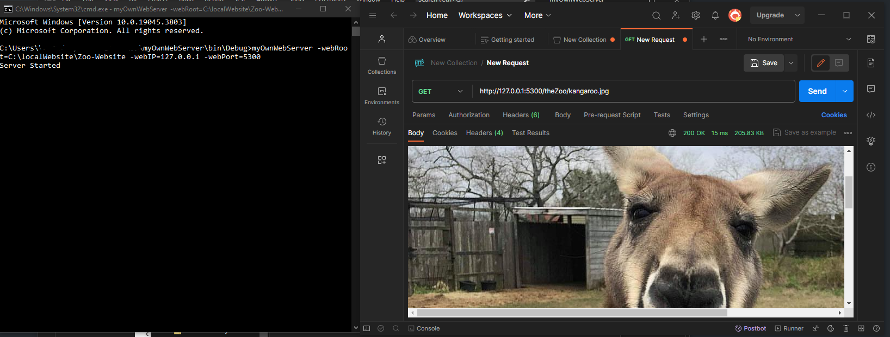

### Web Server Console Application
simple single-threaded web server written in C# as a console application built upon the .NET framework. It supports basic HTTP/1.1 functionality with a focus on handling *GET requests for text, HTML, JPG, and GIF files*.


#### Usage
```myOwnWebServer –webRoot=C:\localWebSite –webIP=192.168.100.23 –webPort=5300```

Make sure to replace the values for webRoot, webIP, and webPort with your specific configuration.

#### How to use
Build the project in visual studio and then run the exe with the arguments in format specified earlier. 

